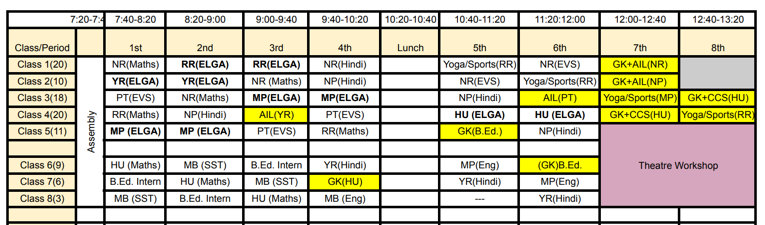

import ReactPlayer from "react-player"

# Plans and activities

## First day plan

+ Timetable for the first month April 2024

+ Assembly for all the classes will happen together in the old building.
+ First subject teacher of every class will be the Class teacher of that class.
+ Class teachers of classes 6-8 will take students with them to the new building after the assembly.

+ Following message will be sent to the students before 1st April.

:::info[Message to be sent to the students before the new session opening]

Dear Students,

Welcome to the class &#x5f;&#x5f;&#x5f;&#x5f;&#x5f;  in new academic session. The classes will start from tomorrow. The school timings will be 7:15 AM to &#x5f;&#x5f;&#x5f;&#x5f;&#x5f;  PM.
Here are a few things that you should do before tomorrow coming to school.
1. In all your new notebooks write the following pledge on the first page (after the index page) for keeping your notebook neat and clean.

<table>

<tr>
<td>

<b>My Notebook Pledge</b>

This notebook has &#x5f;&#x5f;&#x5f;&#x5f;&#x5f; pages. I promise to take good care of it. I will not tear off any page and will write neatly and carefully.

Student Signature: &#x5f;&#x5f;&#x5f;&#x5f;&#x5f;&#x5f;&#x5f;&#x5f;&#x5f;&#x5f;&#x5f;&#x5f;&#x5f;&#x5f;&#x5f;  
Teacher Signature: &#x5f;&#x5f;&#x5f;&#x5f;&#x5f;&#x5f;&#x5f;&#x5f;&#x5f;&#x5f;&#x5f;&#x5f;&#x5f;&#x5f;&#x5f;  
Parent/Guardian Signature: &#x5f;&#x5f;&#x5f;&#x5f;&#x5f;&#x5f;&#x5f;&#x5f;&#x5f;&#x5f;&#x5f;&#x5f;&#x5f;&#x5f;&#x5f;

</td>
</tr>
</table>

2. You must have at least one notebook from the last year that still has some empty pages. Bring one such notebook with you tomorrow for doing
warm-up activities.
3. Bring your pencils/pens, erasers and pencil colors/crayon colors to do some creative activities at school.

We are looking forward to see you bright and early tomorrow! It is going to be a fantastic year!

Warmly,

Parishkaaram Public School
:::

+ On the first day every subject teacher will
   - Start with some icebreaker activities (introduction, stories, games, drawing) to make students comfortable in the class.
   - Make them count the pages in their subject notebook and fill their pledge written on the first page.
   - If time permits then do some subject specific warm-up activities

