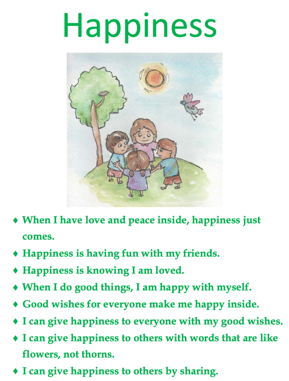

import ReactPlayer from "react-player"

# Value education

+ Happiness
  - 
  - How to make them realize the reason of 'their' happines, 'others' happiness?
     - role play,
     - reflection,
     - drawing something that they consider a happy day.
     - Based on their experience what makes other happy?
  - Stories and questions.
+ Peace
+ Respect
+ Love and Caring
+ Tolerance
+ Honesty
+ Responsibility